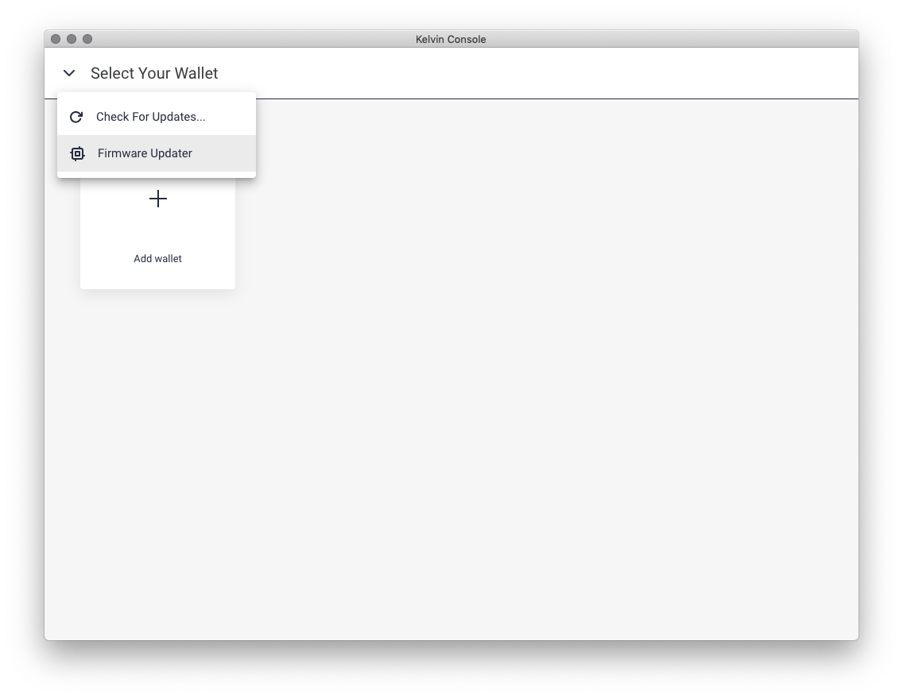

# kelvinwallet-firmware

This repository contains information about updating Firmware on your
KelvinWallet.

## Enter Firmware Update Mode

Steps to enter firmware update mode of a KelvinWallet:

1.  Press and hold button R while plugging in USB C cable.
2.  Hold the button (about 5 seconds) until you see `FW UPDATER` on screen.

## Check Installed Firmware Version

Steps to check the currently installed firmware version of your KelvinWallet:

1.  Enter firmware update mode
2.  You should see something like:
    ```
    +-----------------------+
    | FW UPDATER 0.0.35     |
    |                       |
    | current FW version is |
    | 0.1.2                 |
    |                       |
    +-----------------------+
    ```
3.  If a signed firmware is properly installed, you should see the version
    assigned to it on the third line of the screen like the above example.
    The firmware version is `0.1.2` for the above example.

## Download Latest Firmware

You can find download link to latest firmware in [CHANGELOG.md](CHANGELOG.md)

## Apply Firmware Update with Kelvin Console

1.  Download and install Kelvin Console from
    https://www.kelvinwallet.com/kelvin-console
2.  Open Kelvin Console, enter "Firmware Updater" from the dropdown menu at
    the top left corner:
    
3.  Click "OPEN FILE" to select the firmware binary file you downloaded.
4.  Hold button R while plugging in your KelvinWallet to make it enter
    firmware update mode.
5.  Click "UPDATE" to send firmware update initiation command
6.  You need to approve the firmware update operation on KelvinWallet,
    following the instructions printed on hardware OLED display.
7.  Wait until the firmware update finishes.
